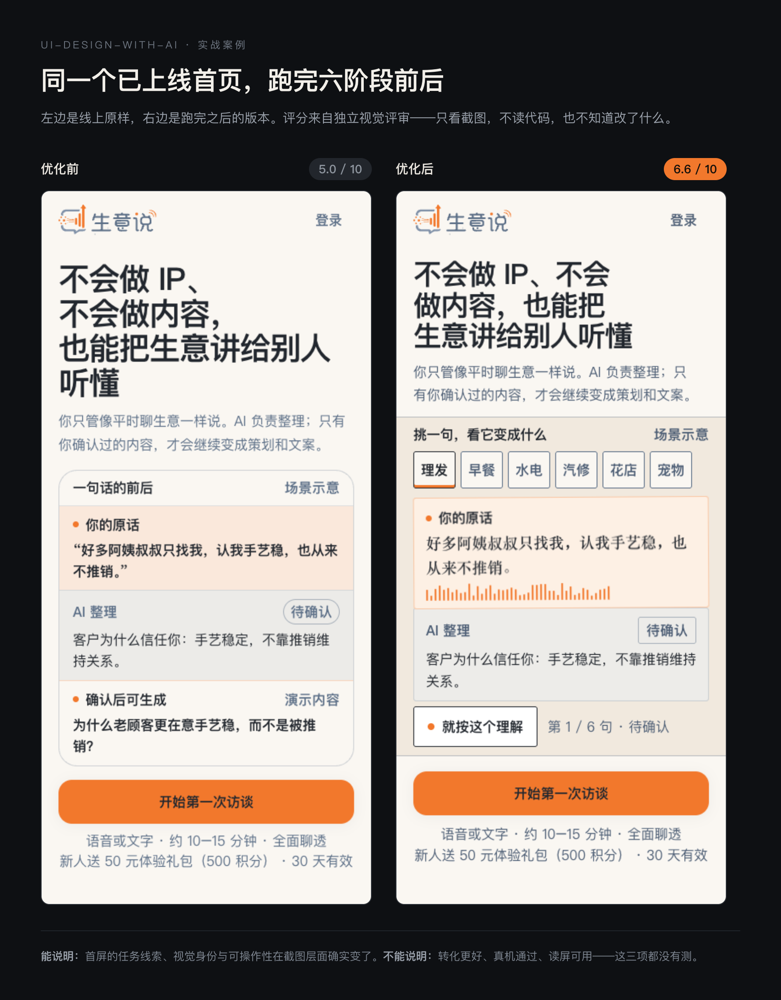
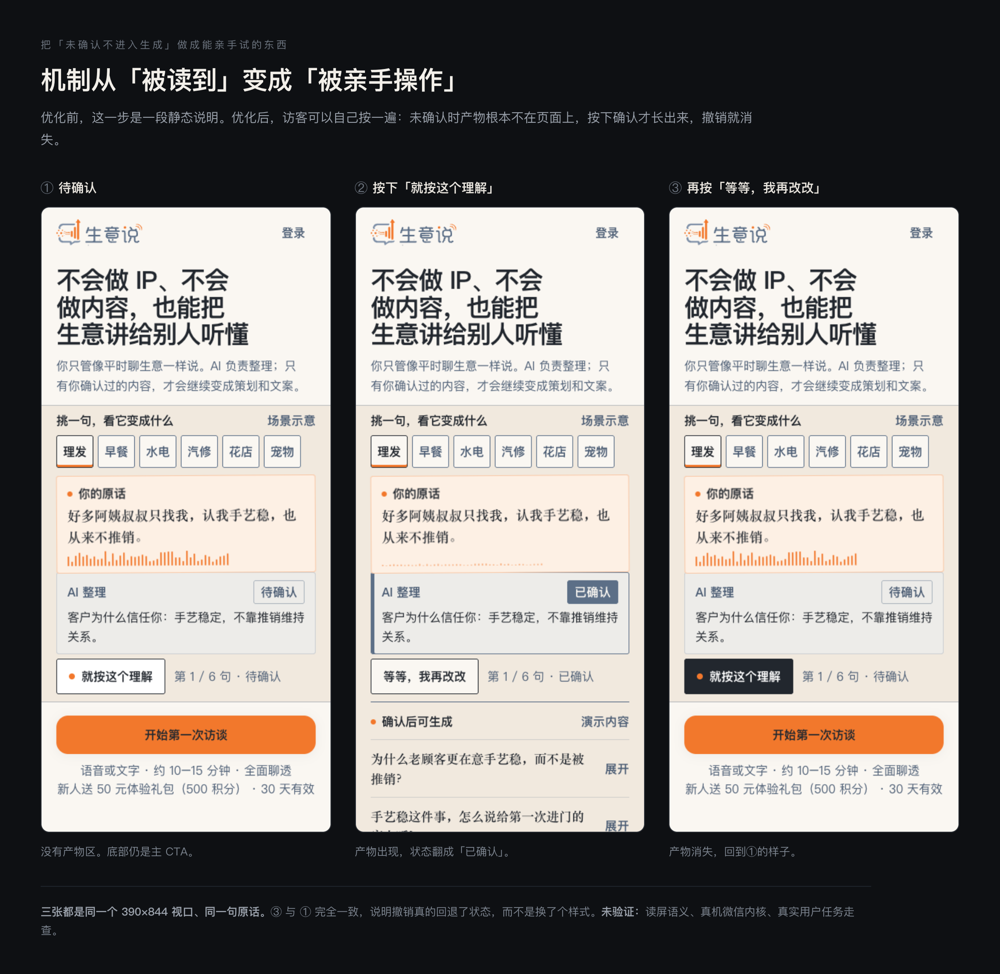
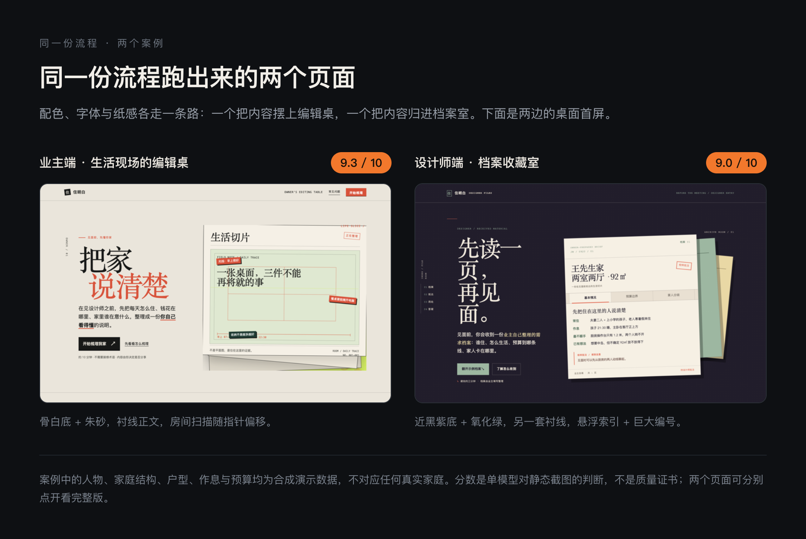
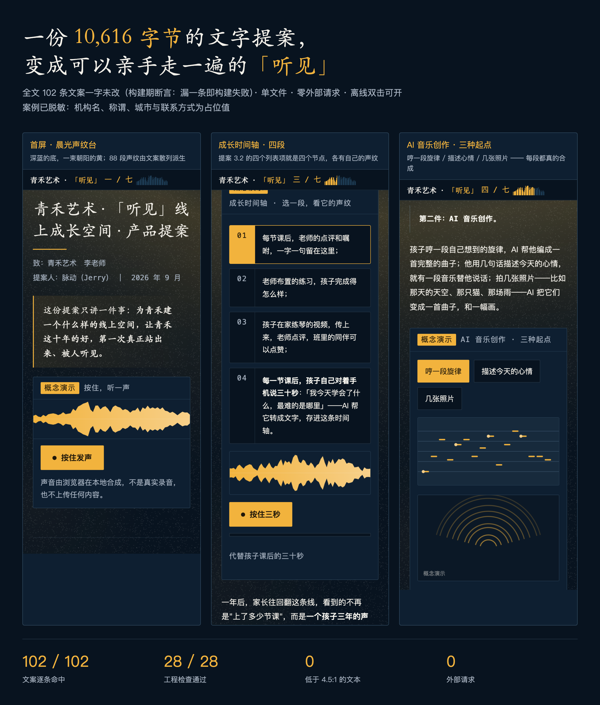

# ui-design-with-ai

**用 AI 做出有设计感的 Web UI，而不是又一套模板。**

一套六阶段的设计与验证 Harness：把需求定义、视觉发散、实现、静态视觉评审、工程 QA 分开记录，让「好看」这件事**可以被复核，而不是靠感觉**。

> **EN** — A six-stage design & verification harness for producing Web UI with AI. Requirement definition, visual divergence, implementation, static visual critique and engineering QA are kept separate, so "it looks good" can be checked rather than felt.

> Discover → Define → Develop → Build → Critique → Deliver



上面这个页面是真实跑出来的：左边是线上原样，右边是跑完之后。评分来自一个**只看截图、不读代码、也不知道改了什么**的独立视觉评审。

**[看效果](#先看效果)** · **[怎么用](#怎么用)** · **[一起共创](#一起共创)** · **[我会一直优化](#我会一直优化)**

---

## 先看效果

### 一、把「只有确认才继续」从一句话，变成能亲手试的东西



优化前，这一步是一段静态说明，访客只能读。优化后，访客可以自己按一遍：未确认时产物**根本不在页面上**，按下确认才长出来，撤销就消失。

三张图是同一个 390×844 视口、同一句原话——③ 和 ① 完全一致，说明撤销真的回退了状态，而不是换了个样式。

**这一轮里，工程 QA 抓到的东西比分数更值钱：**

- 新增的台面色让品牌蓝灰掉到 **4.28:1**，低于 WCAG AA——一个新增表面引入的可访问性回归；
- 首屏出现了两个互相争抢的主按钮，而且把「人拍板」这个关键动作画成了机器色；
- 为了让底色出血而插入的媒体查询，把二维码的契约测试打红了——**我自己修出来的新回归**。

三个都是真实缺陷，都已修掉并复验（390/1440/320 三档全状态下，低于 4.5:1 的文本节点为 0）。

### 二、同一份流程，跑出两个不同路线的页面



### 三、把一份 10,616 字节的文档，一字不改做成能按的页面



这个案例的约束不一样：源文档是一份中文产品提案，**文案一字不能改**。所以保真没有靠人抄、也没有靠通读检查，而是做成了构建期约束——文案由脚本从文档提取，页面模板只写占位符，**构建时漏一条就失败**；验收时再逐条比对渲染后的 DOM（开 JS / 关 JS 各一遍）。

### 案例一览

| 案例 | 独立视觉评审 | 能说明什么 | 不能说明什么 |
|---|---:|---|---|
| [生意说首页互动化](case-studies/shengyi-next-landing/README.md) | 5.0 → 6.6 | 在已上线产品上跑完六阶段：把「只有确认才继续」从文字声明改成可亲手操作的结构；工程 QA 阻断项 0 | 不代表转化更好、真机通过或读屏可用；改动已提交到本地 main（`41f5d2d`），未推送、未部署 |
| [「听见」提案落地页](case-studies/music-school-proposal/README.md) | 见案例 | 把一份 102 条文案的长文档做成可交互单页，**文案 102/102 逐条命中且顺序一致**，工程检查 28/28 PASS；三轮独立视觉评审的成立项全部落地并复验 | 已脱敏（机构名/称谓/城市/联系方式为占位值）；不代表真人用过、真机通过或读屏可用；页内互动均为概念演示 |
| [业主端 · 生活现场的编辑桌](examples/owner-side/index.html) | 9.3/10 | 当时截图上的设计身份和可见层级得到认可 | 不代表屏幕阅读器、性能、真机或用户任务通过 |
| [设计师端 · 档案收藏室](examples/designer-side/index.html) | 9.0/10 | 当时截图上的档案视觉方向得到认可 | 不代表生产级整体质量或跨模型稳定性 |

生意说案例还附一个[可拖动的前后对比页](case-studies/shengyi-next-landing/compare.html)，以及 21 张前后截图。

完整限制见[公开案例证据包](case-studies/owner-side/README.md)与[生意说首页案例](case-studies/shengyi-next-landing/README.md)。案例中的人物、家庭结构、户型、作息和预算均为合成演示数据；证据包保留 brief、方向、identity、评审记录和 QA，但模型精确版本、完整 token/耗时和真实用户测试未记录，**不得据此宣称「小白稳定复现」**。

---

## 它是什么

更适合被理解为一套可复用工作流，而不是「神级提示词」。

| 模式 | 做什么 |
|---|---|
| `CREATE` | 从需求创建 Web 页面或 Web app 界面 |
| `REDESIGN` | 重做现有网页 |
| `CRITIQUE` | 只做静态视觉评审 |
| `QA` | 只验证并报告交互、响应式、无障碍和工程质量，不改产品代码 |
| `COMPONENT` | 创建或重做 Web 组件与适用状态 |

不用于原生 iOS/Android App、纯平面海报或仅生成图片。

## 核心边界

这部分我写得很硬，因为它决定这套东西能不能被信任：

- **Visual Critic 只评价截图看得见的东西**——任务线索、层级、构图、设计身份、细节。截图不能证明的交互、键盘、读屏、性能一律 `N/A`，不进入视觉总分。
- **Engineering QA 只使用 `PASS / FAIL / N/A / NOT TESTED` 和证据矩阵**，不用视觉分代替验证。
- **自动评审轮数只是预算上限，不等于通过。**
- 方向数、并行实例、参考图数量、设计旋钮与评分线都是**可调整 heuristic**，不是质量保证。
- 目前没有多任务、多名操作者的对照实验，因此**不宣称已经证明「稳定产出顶级 UI」**。

## 怎么用

### 安装

**Agent Skills 目录**（以 Claude Code 为例）：

```bash
mkdir -p ~/.claude/skills

git clone https://github.com/xie1701/ui-design-with-ai.git \
  ~/.claude/skills/ui-design-with-ai

test -f ~/.claude/skills/ui-design-with-ai/SKILL.md
```

其他支持 Agent Skills 的工具，把仓库 clone 到其 skills 目录下的 `ui-design-with-ai/` 即可。

**Cola 本地开发**：

```bash
mkdir -p ~/code ~/.cola/skills
git clone https://github.com/xie1701/ui-design-with-ai.git ~/code/ui-design-with-ai
ln -s ~/code/ui-design-with-ai ~/.cola/skills/ui-design-with-ai
```

**任意聊天工具**：

1. 打开[主控提示词](references/master-prompt.md)，贴入新对话；
2. 按任务选择 CREATE / REDESIGN / CRITIQUE / QA / COMPONENT；
3. Visual Critic 使用[独立评审协议](references/critic-prompt.md)，最好放在不含实现历史的新对话里；
4. 工程验收使用 [QA 模板](references/qa-template.md)。

### 截图协议

评审包至少包含：首屏目标视口、全页图、关键局部裁剪。记录 CSS 视口、device scale factor、浏览器/引擎和页面状态；外发前先脱敏。

已验证过的一种命令是使用本机 Chrome：

```bash
npx playwright screenshot --channel=chrome \
  --viewport-size=390,844 --full-page --wait-for-timeout=1500 \
  <url> out.png
```

这不是唯一方案。没有 system Chrome 时可用 Playwright bundled Chromium/Firefox/WebKit，或其他能设置真实 CSS 视口并输出截图的工具；应记录工具与版本，并核对 CSS viewport、截图像素尺寸和 DSF。

> 踩过的坑：macOS 上 Chrome headless 用 `--window-size=390` 会**按 756px 布局再缩放**输出，必须用 `--viewport-size`（Playwright）才拿到真实视口。
>
> 另一个更隐蔽的坑：**`fullPage` 全页截图在 device pixels 超过约 16384 时会产出与页面不对应的图**（图看起来正常，内容是错的）。先算 `scrollHeight × DSF`，超限就改成滚动分段拼接。**而且即使不超限，只要页面有 `position:fixed` 的顶栏或侧轨，也不能用 `fullPage`**——它只会把固定元素画在页面顶部一次。还有一条：**滚动驱动的视觉（光的角度、进度、视差）不能用全页图取证**，分段拼接冻结的是不同状态。定位关键局部时，优先「把元素滚进视口后截视口」，而不是用全页图加坐标裁剪。详见 [`case-studies/music-school-proposal/scripts/fullpage.mjs`](case-studies/music-school-proposal/scripts/fullpage.mjs)。

### 文件结构

```text
ui-design-with-ai/
├── SKILL.md
├── CONTRIBUTING.md            # 共创指南
├── assets/                    # README 用的效果图
├── references/
│   ├── master-prompt.md
│   ├── brief-template.md
│   ├── directions-template.md
│   ├── design-identity-template.md
│   ├── critic-prompt.md
│   ├── critic-log-template.md
│   ├── quality-rubric.md
│   ├── qa-template.md
│   ├── prompt-graveyard-template.md
│   └── source-notes.md
├── scripts/
│   ├── create-design-seed.py
│   └── create-design-seed.sh
├── examples/
└── case-studies/
    ├── owner-side/
    ├── shengyi-next-landing/   # 含可拖动的前后对比页 compare.html
    └── music-school-proposal/  # 含可复用的可靠全页截图实现 fullpage.mjs
```

仓库根目录就是 Skill 根目录，`SKILL.md` 不再嵌套一层。

### 依赖

- Skill 文档本身无平台专有依赖。
- 设计种子优先使用 Python 3：`python3 scripts/create-design-seed.py`。
- `scripts/create-design-seed.sh` 是兼容入口：优先调用 Python 3；缺少 Python 时在有 `/dev/urandom` 的 Unix 环境回退。
- 截图和 QA 工具按项目环境选择，Playwright 只是示例。

---

## 一起共创

这套东西的价值，取决于它被用在多少种真实的页面上。所以我真心欢迎你一起把它做厚——**一个人的案例跑不出通用规则，十个不同行业的页面才可以。**

**我特别想要这四类东西：**

1. **带证据的实战案例。** 你用这套流程跑了什么页面、跑到哪一步、结果如何。哪怕结果不好也有价值——失败案例比成功案例更能暴露规则的问题。
2. **失效的规则。** 哪条启发式在你的场景里明显不成立？直接丢进 prompt graveyard，附上你踩坑的现场。
3. **设计判断规则。** 「什么时候该打破哪条规则」——这是目前最难自动化的部分，也是我最缺的。
4. **复现失败报告。** 按上面的安装步骤跑不起来、脚本报错、文档自相矛盾，都请直接开 Issue。

**提之前请守住三条**，这是这个仓库唯一的门槛：

- **结论先行，附证据**——命令、截图、原始输出，不要只给结论；
- **写明边界**——哪些测了、哪些没测。`NOT TESTED` 比编一个「通过」有价值得多；
- **涉及真实数据就先脱敏**——人名、家庭结构、户型、预算、品牌信息，要么脱敏，要么明确标注为合成数据。

**怎么提：** 到 [Issues](https://github.com/xie1701/ui-design-with-ai/issues) 说想法，或直接 PR 到 `case-studies/`。案例需要的那几份文档，直接照 `references/` 里的模板抄：[brief](references/brief-template.md)、[directions](references/directions-template.md)、[design-identity](references/design-identity-template.md)、[critic-log](references/critic-log-template.md)、[qa](references/qa-template.md)。**采纳的案例会带你的署名留在仓库里。**

## 我会一直优化

每个实战案例跑完，我都会把暴露的问题**回修进 `SKILL.md` 本身**，而不是只写一份总结——这已经是这个仓库的固定动作。到目前为止回修过的包括：截图管线必须用真实 CSS 视口、评审员的事实性陈述必须抽查复核、整页长图不能直接丢给视觉模型提问、以及**全页截图不能用 `fullPage`（device pixels 超过约 16384 会静默产出与页面不对应的图）**。

接下来要补的，都是目前明确标着 `NOT TESTED` 的：

- [ ] **真机与浏览器矩阵**：现在只有 system Chrome、DSF 1。微信内置内核、DPR 2/3、Safari/Firefox 都没测。
- [ ] **读屏走查**：VoiceOver / NVDA 全流程。现在只有 ARIA 语义的静态检查。
- [ ] **真实用户任务走查**：现在所有评分都是单模型看静态截图，**没有人真正用过页面**。
- [ ] **多任务、多操作者对照**：这是「稳定产出顶级 UI」目前不能成立的原因。没有对照实验之前我不会这么宣称。
- [ ] **QA 证据自动化**：案例证据包里还有大量 `NOT TESTED`，因为当时的原始命令和输出没保存下来。要让证据能自证，这一步得自动化。
- [ ] **平台扩展**：目前刻意收紧为 Web UI。原生 App 不在范围内，除非有人带着真实案例来。

想让我先做哪一条，开 Issue 说。

## 来源

方法来源与哪些内容属于工程化推演，见 [source notes](references/source-notes.md)。

## License

MIT
